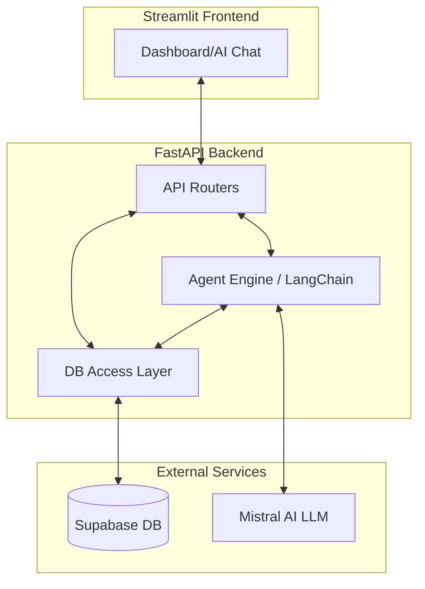
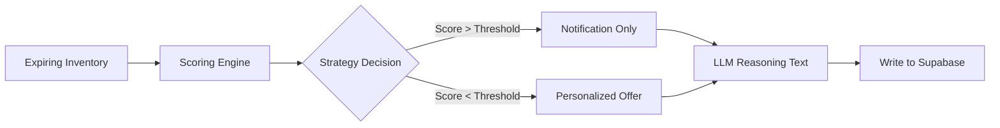
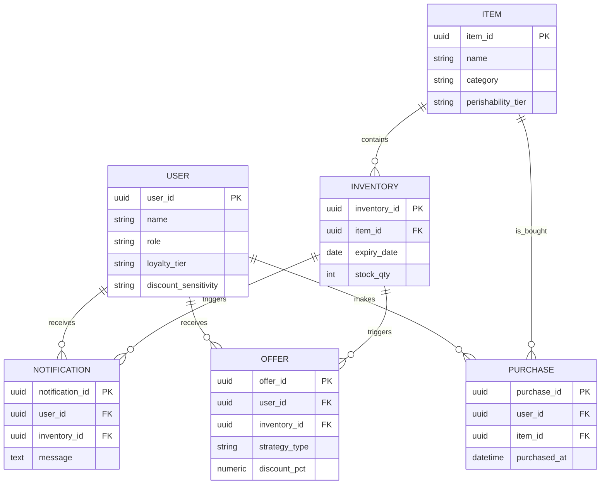
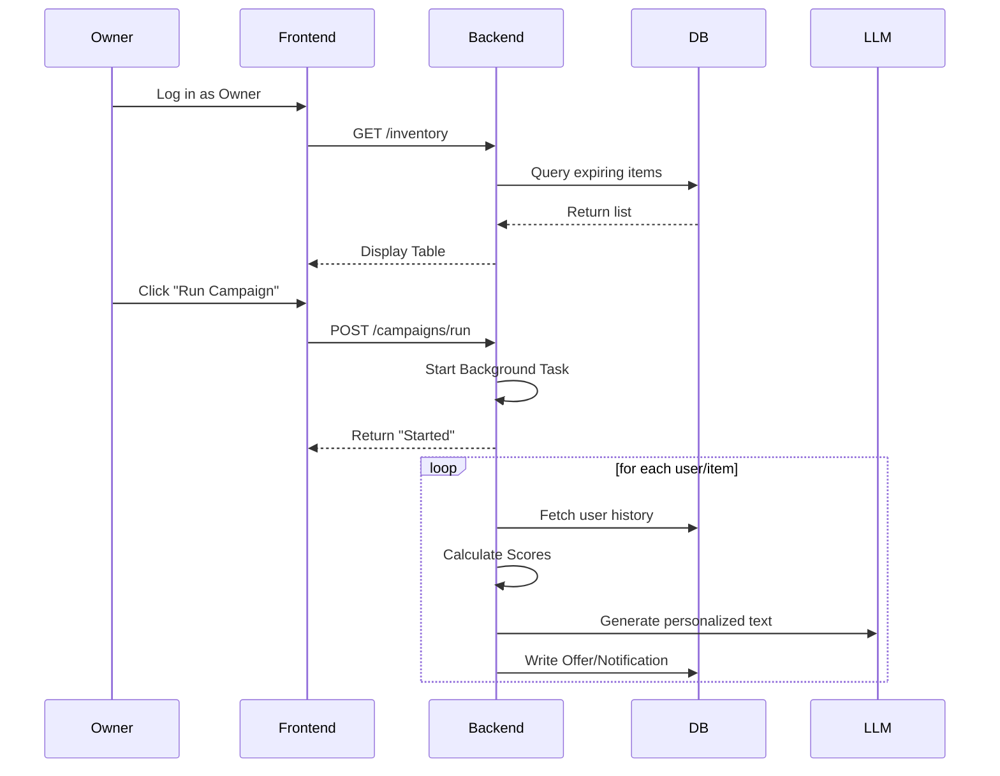

# Retail Expiry Campaigner

Track retail products approaching expiry and trigger targeted campaigns.

## System Architecture

### Data & Logic Flow


### Campaign Decision Pipeline


### Database Schema


### User Flow


## Project layout

```
.
├── backend/        FastAPI API (routers/, main.py)
├── frontend/       Streamlit app (app.py, pages/)
├── .venv/          Python virtual environment (shared)
└── agents.md       Developer/agent instructions
```

## Prerequisites

- Python 3.13
- Node not required (Streamlit serves the frontend)

## Setup

1. Create and activate the virtual environment:

   ```bash
   python3 -m venv .venv
   source .venv/bin/activate
   ```

   (Or on Windows: `.venv\Scripts\activate`)

2. Install backend dependencies:

   ```bash
   pip install -r backend/requirements.txt
   ```

3. Install frontend dependencies:

   ```bash
   pip install -r frontend/requirements.txt
   ```

## Running

### Backend (from root)

```bash
uvicorn backend.main:app --reload
```

- API docs: http://localhost:8000/docs
- Health check: http://localhost:8000/health

### Frontend (from root)

```bash
streamlit run frontend/app.py
```

- App: http://localhost:8501

## Database & Seeding

To populate the database with mock data, run the following from the root directory:

### Seed Data (Append)
```bash
export PYTHONPATH=$PYTHONPATH:. && ./.venv/bin/python backend/seed.py
```

### Reset & Seed (Clean Slate)
```bash
export PYTHONPATH=$PYTHONPATH:. && ./.venv/bin/python backend/seed.py reset
```

## Configuration

- Backend: `frontend/src/config.py` holds the `API_BASE_URL` used to reach the API.
- Streamlit options live in `frontend/.streamlit/config.toml`.
